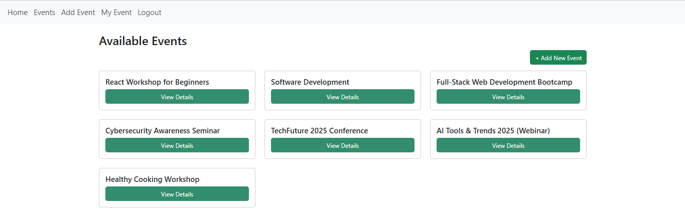

# 🎉 Event Planner - Frontend (React + Vite)

## 🗂️ Project Description
A user-friendly event planning app where users can:
- Create and manage events
- Register attendance
- Add and view event notes

The frontend communicates with a Django backend and provides an intuitive interface for managing events efficiently.

---

### Tech Stack
- React
- JavaScript
- Vite
- Axios
- React Router DOM

## 🗄️ Backend Repository
   [Event Planner - Backend](https://github.com/Afnan112/django-event-planner-backend)

---

## 🚀 Installation Instructions

```bash
# Clone the repo
git clone https://github.com/Afnan112/react-event-planner-frontend.git

# Navigate to project directory
cd react-event-planner-frontend

# Install dependencies
npm install

# Run the development server
npm run dev
```

#### App Screenshots

### Home page  


### Events List page 

